# Case Study - Simple Banking API

<p align="center">
    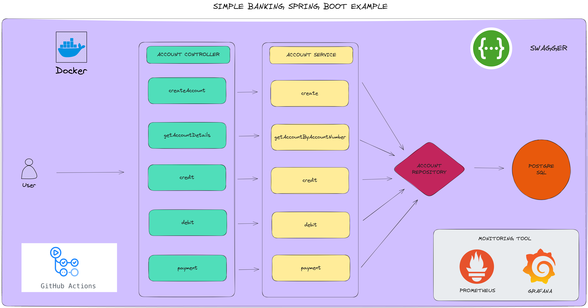
</p>

In this assignment you will build a banking service that can handle any number of transactions for bank accounts. The service is part of a larger collection of services that model the inner workings of a bank. The services for the "bank account" provide a simple model of how bank accounts might work in an overly simplified world.

For this assignment, the bank account is exclusively interested in maintaining the name of the account owner, the number of the account and the account’s balance. The endpoints will be limited to methods that provide a means of crediting and debiting the account. 

Your data model for the bank account object must have fields owner where the field type is java.lang.String, fields to hold the account number (String) and balance (double). the credit() service as specified above adds the supplied amount to the receiving BankAccounts balance and the the debit() service subtracts the supplied amount from the receiving BankAccounts balance.  

The object model for our banking system must include transaction objects. A transaction object keeps track of the kind of transaction (deposit, withdrawal, payments etc.) as well as the date and amount of the transaction. Each transaction type will require its own parameters. The following diagram shows how BankAccounts and Transactions are related. An instance of DepositTransaction represents a deposit; a WithdrawalTransaction represents a withdrawal (the triangle on the diagram indicates inheritance). Inheritance for the PhoneBillPaymentTransaction, CheckTransaction etc. is not shown - you must decide where to put this class.  All transactions must have  have the fields date and amount at a minimum. The date field should contain the time of the transaction and should be automatically calculated.

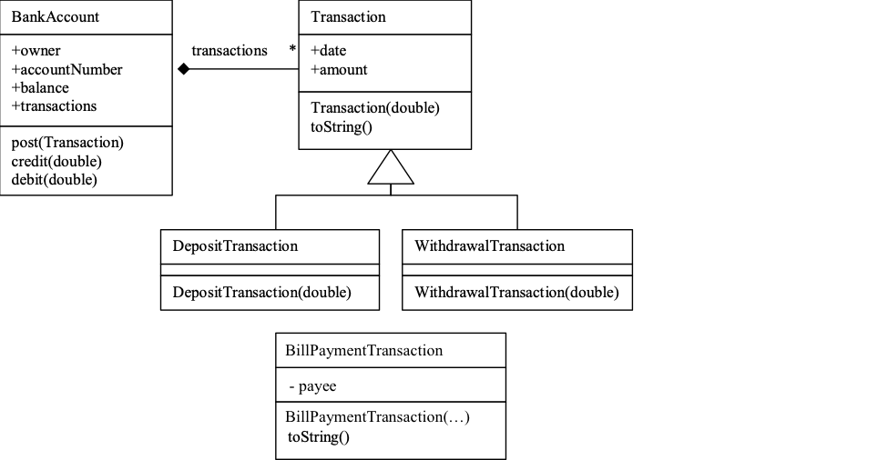

## You can use provided project template as a start
The template project (gradle Java) is available under the src folder.  We recommend that you use Quarkus or Spring(boot), Junit, JPA as the primary choices for your implementation.

## Task 1: Implement and test the model
These transaction objects will be used both to make financial requests of a BankAccount and to keep a record of those requests. The following Unit test segment indicates how transactions will be used on the service side:

    BankAccount account = new BankAccount("Jim", 12345);
    account.post(new DepositTransaction(1000));
    account.post(new WithdrawalTransaction(200));
    account.post(new PhoneBillPaymentTransaction("Vodafone", "5423345566", 96.50));
    assertEquals(account.getBalance(), 703.50, 0.0001)

### BONUS Task 1: Find a better implementation alternative
The bank account post method must do something special for each Transaction type. e.g. post(DepositTransaction) and post(WithdrawalTransaction. This solution will work but creating families of overloaded methods is discouraged as it causes problems with maintenance. Consider, if we added more Transaction subclasses we would need to keep changing the BankAccount class, overloading even more post methods. It is considered bad form in OO  to write case statements based on the type of objects. It also has the same maintenance problems as the first solution. Adding more Transaction subclasses would require changes. Find a solution to delegate the operation using polymorphism so that the Bank account is never changed by introducing new transaction types. At a öinimum you shoudl make the provided uni test to run:


## Task 2:  Provide a REST API using Spring Rest Controllers and TEST
Provide a REST API to the banking system as follows. The following code demonstrates how BankAccounts might be used.  Use services and repositories to persist your model above into a Database using JPA.  Please provide tests (MOCK or othrewise) for your code:

To deposit money into an account, one would use:

    curl --location --request POST 'http://localhost:8080/account/v1/credit/669-7788' \
    --header 'Content-Type: application/json' \
    --header 'Accept: application/json' \
    --data-raw '    {
            "amount": 1000.0
        }'

    response would be (200):
    {
        "status": "OK",
        "approvalCode": "67f1aada-637d-4469-a650-3fb6352527ba"
    }

To withdraw money:

    curl --location --request POST 'http://localhost:8080/account/v1/debit/669-7788' \
    --header 'Content-Type: application/json' \
    --header 'Accept: application/json' \
    --data-raw '    {
            "amount": 50.0
        }'

    response would be (200):
    {
        "status": "OK",
        "approvalCode": "a66cce54-335b-4e46-9b49-05017c4b38dd"
    }

To get the current account data, one would use:

    curl --location --request GET 'http://localhost:8080/account/v1/669-7788'

    response would be:

    {
        "accountNumber": "669-7788",
        "owner": "Kerem Karaca",
        "balance": 950.0,
        "createDate": "2020-03-26T06:15:50.550+0000",
        "transactions": [
            {
                "date": "2020-03-26T06:16:03.563+0000",
                "amount": 1000.0,
                "type": "DepositTransaction",
                "approvalCode": "67f1aada-637d-4469-a650-3fb6352527ba"
            },
            {
                "date": "2020-03-26T06:16:35.047+0000",
                "amount": 50.0,
                "type": "WithdrawalTransaction",
                "approvalCode": "a66cce54-335b-4e46-9b49-05017c4b38dd"
            }
        ]
    }

### Explore Rest APIs

<table style="width:100%">
  <tr>
      <th>Method</th>
      <th>Url</th>
      <th>Description</th>
      <th>Request Body</th>
      <th>Header</th>
      <th>Valid Path Variable</th>
      <th>No Path Variable</th>
  </tr>
  <tr>
      <td>POST</td>
      <td>/api/v1/account/createAccount</td>
      <td>Create Account</td>
      <td>CreatedAccountRequest</td>
      <td></td>
      <td></td>
      <td></td>
  <tr>
  <tr>
      <td>GET</td>
      <td>/api/v1/account/account-number/{accountNumber}</td>
      <td>Get Account Details</td>
      <td></td>
      <td></td>
      <td>accountNumber</td>
      <td></td>
  <tr>
  <tr>
      <td>POST</td>
      <td>/api/v1/account/credit</td>
      <td>Deposit Money to Account</td>
      <td>CreateCreditRequest</td>
      <td></td>
      <td></td>
      <td></td>
  <tr>
  <tr>
      <td>POST</td>
      <td>/api/v1/account/debit</td>
      <td>Withdraw Money from Account</td>
      <td>CreateWithdrawalRequest</td>
      <td></td>
      <td></td>
      <td></td>
  <tr>
  <tr>
      <td>POST</td>
      <td>/api/v1/account/payment</td>
      <td>Payment of Phone Bill from Account</td>
      <td>CreatePhoneBillPaymentRequest</td>
      <td></td>
      <td></td>
      <td></td>
  <tr>
  
</table>


### Technologies

---
- Java 11
- Spring Boot 2.5.5
- Restful API
- Lombok
- Gradle
- Junit5
- Mockito
- Integration Tests
- Docker
- Docker Compose
- CI/CD (Github Actions)
- Prometheus and Grafana
- Postman
- Actuator
- Swagger 3
- PostgreSQL


### Swagger

```
http://localhost:1222/swagger-ui/index.html
```

### Prerequisites

#### Define Variable in .env file

```
DATABASE_USERNAME={DATABASE_USERNAME}
DATABASE_PASSWORD={DATABASE_PASSWORD}
```

---
- Gradle or Docker
---

### Docker Run
The application can be built and run by the `Docker` engine. The `Dockerfile` has multistage build, so you do not need to build and run separately.

Please follow directions shown below in order to build and run the application with Docker Compose file;

```sh
$ cd simplebanking
$ docker-compose up -d
```

If you change anything in the project and run it on Docker, you can also use this command shown below

```sh
$ cd simplebanking
$ docker-compose up --build
```

---
### Gradle Run
To build and run the application with `Gradle`, please follow the directions shown below;

```sh
$ cd simplebanking
$ gradle clean build
$ gradle bootRun
```

## Reference Documentation
For further reference, please consider the following sections:

* [Official Gradle documentation](https://docs.gradle.org)
* [Spring Boot Gradle Plugin Reference Guide](https://docs.spring.io/spring-boot/docs/2.2.5.RELEASE/gradle-plugin/reference/html/)
* [Spring Boot DevTools](https://docs.spring.io/spring-boot/docs/2.2.5.RELEASE/reference/htmlsingle/#using-boot-devtools)

### Guides
The following guides illustrate how to use some features concretely:

* [Building REST services with Spring](https://spring.io/guides/tutorials/bookmarks/)

### Additional Links
These additional references should also help you:
* [Gradle Build Scans – insights for your project's build](https://scans.gradle.com#gradle)

### Screenshots

<details>
<summary>Click here to show the screenshots of project</summary>
    <p> Figure 1 </p>
    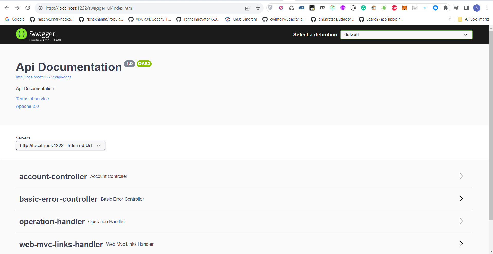
    <p> Figure 2 </p>
    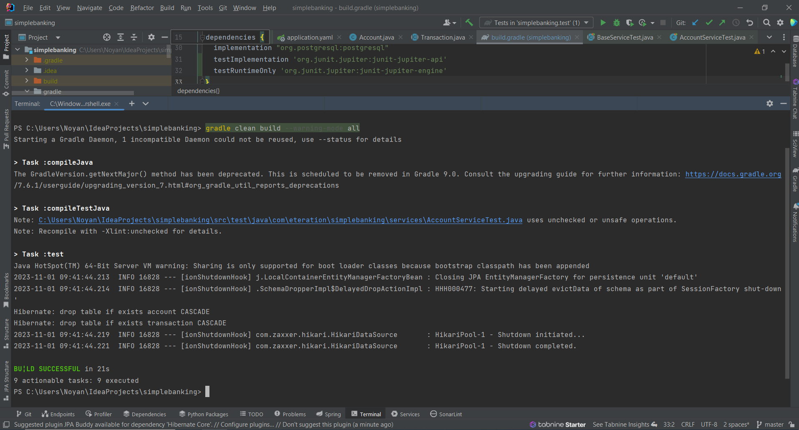
    <p> Figure 3 </p>
    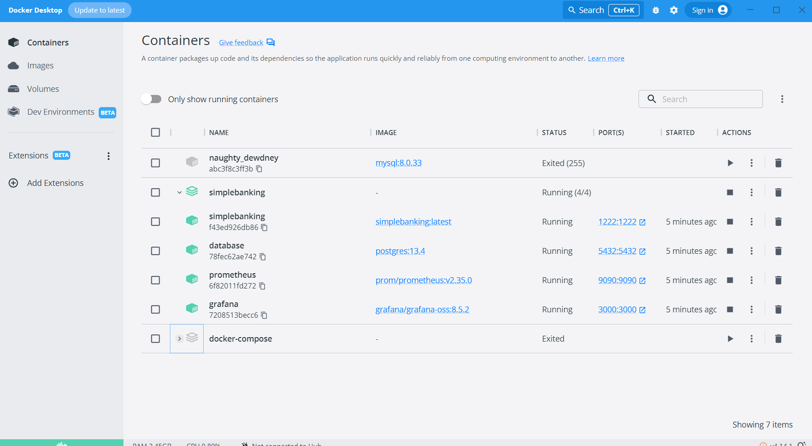
    <p> Figure 4 </p>
    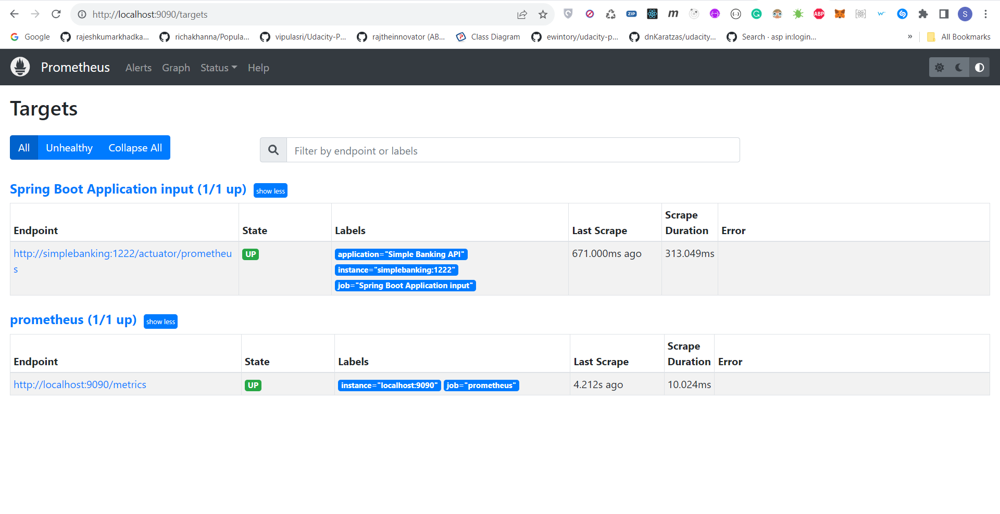
    <p> Figure 5 </p>
    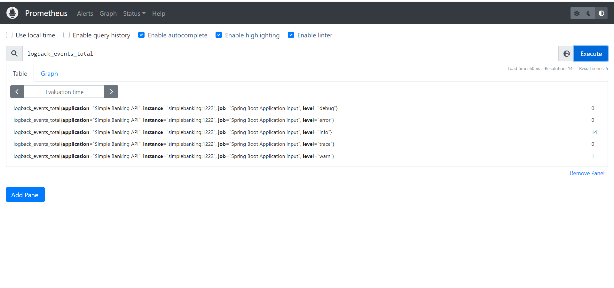
    <p> Figure 6 </p>
    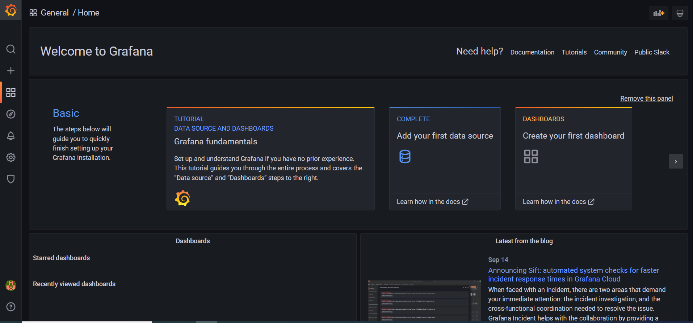
    <p> Figure 7 </p>
    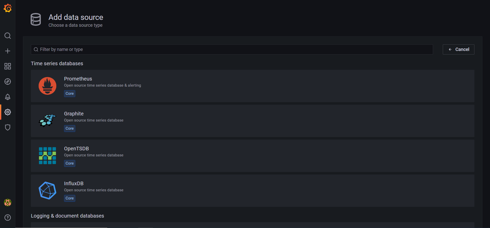
    <p> Figure 8 </p>
    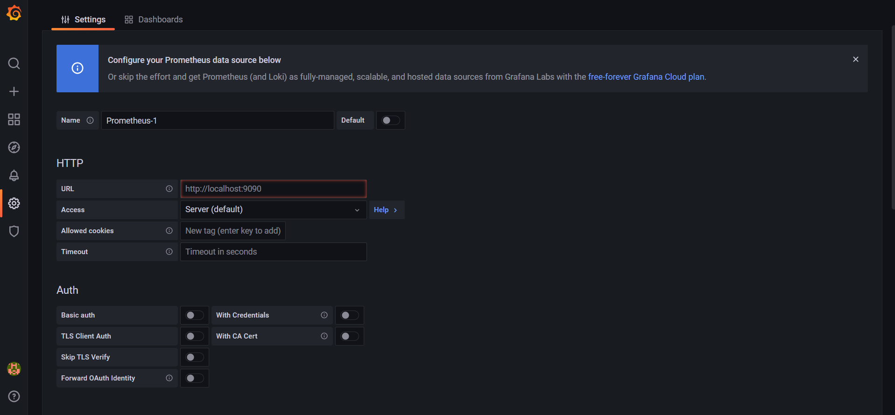
    <p> Figure 9 </p>
    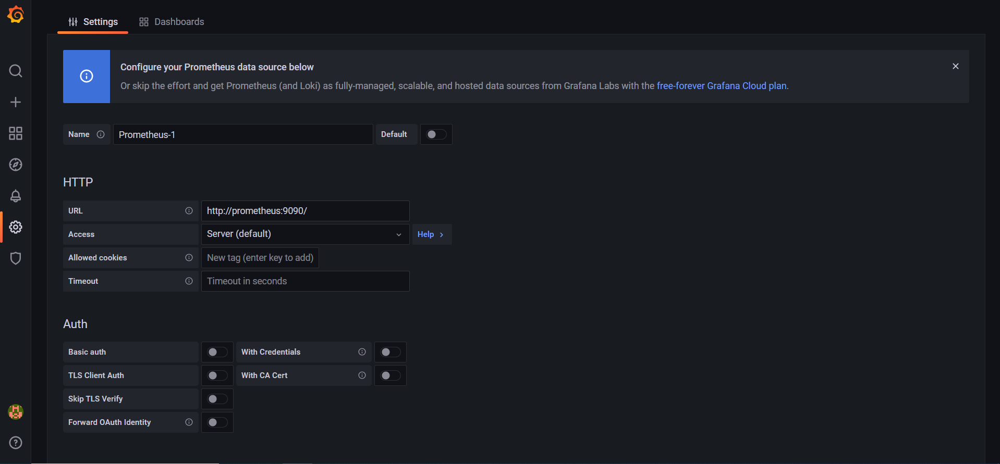
    <p> Figure 10 </p>
    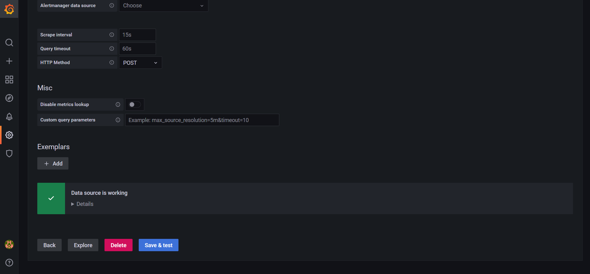
    <p> Figure 11 </p>
    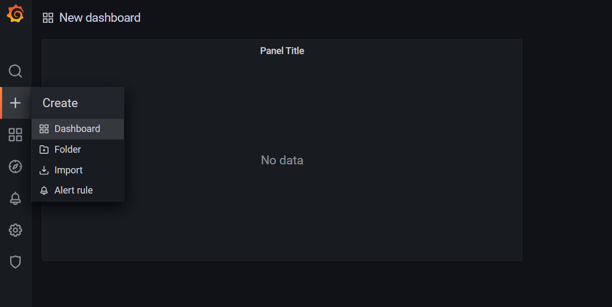
    <p> Figure 12 </p>
    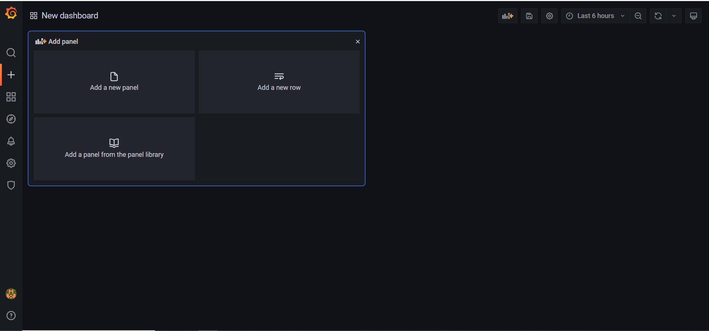
    <p> Figure 13 </p>
    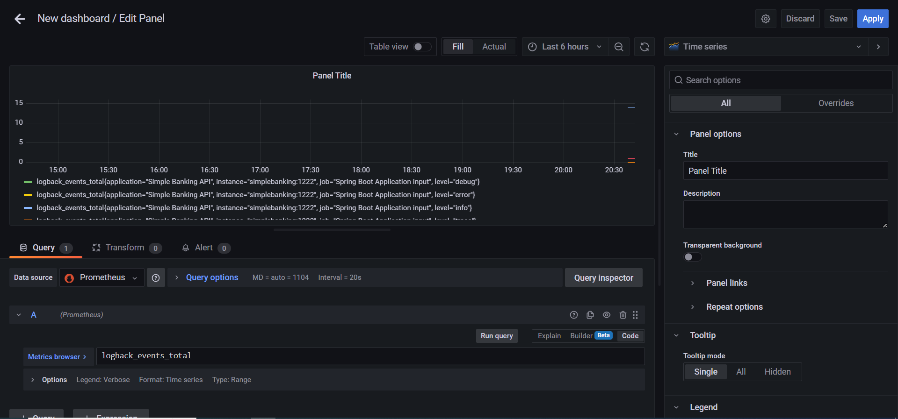
    <p> Figure 14 </p>
    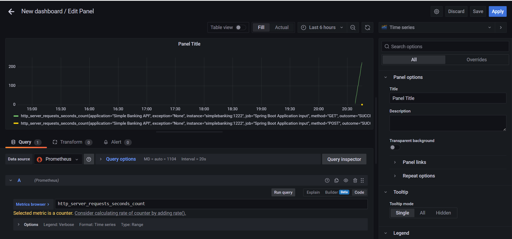
    <p> Figure 15 </p>
    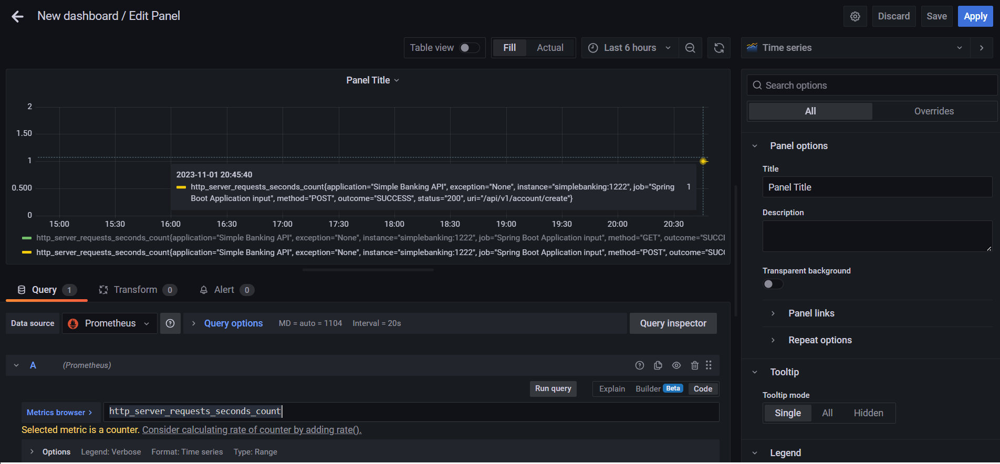
    <p> Figure 16 </p>
    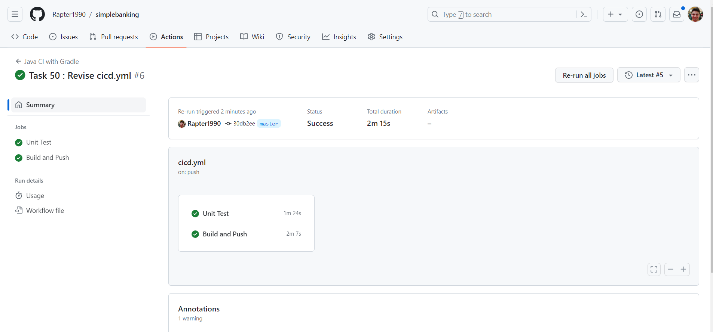
</details>

### Contributors

- [Sercan Noyan Germiyanoğlu](https://github.com/Rapter1990)

